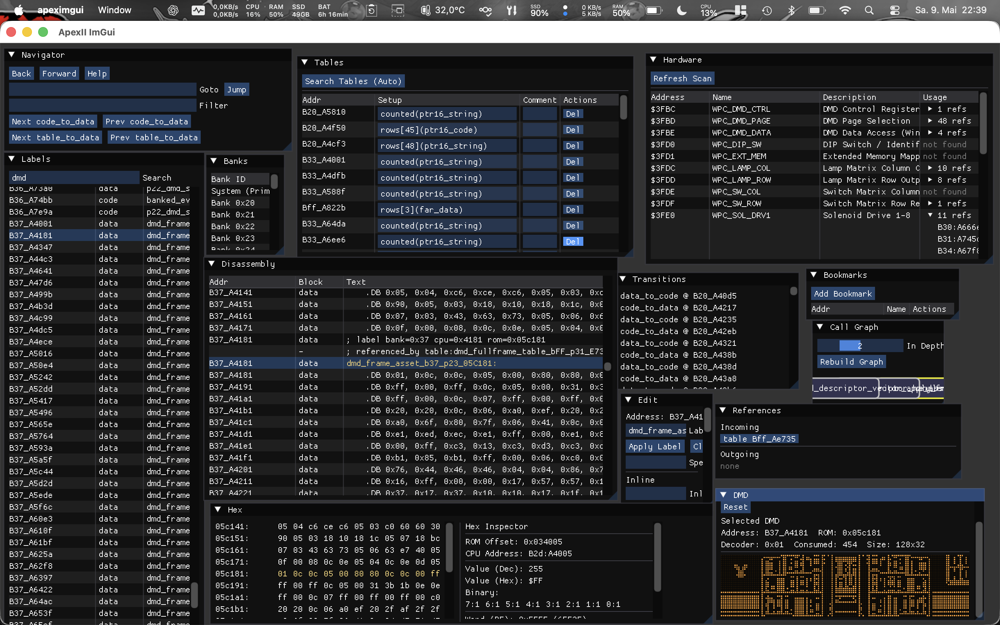
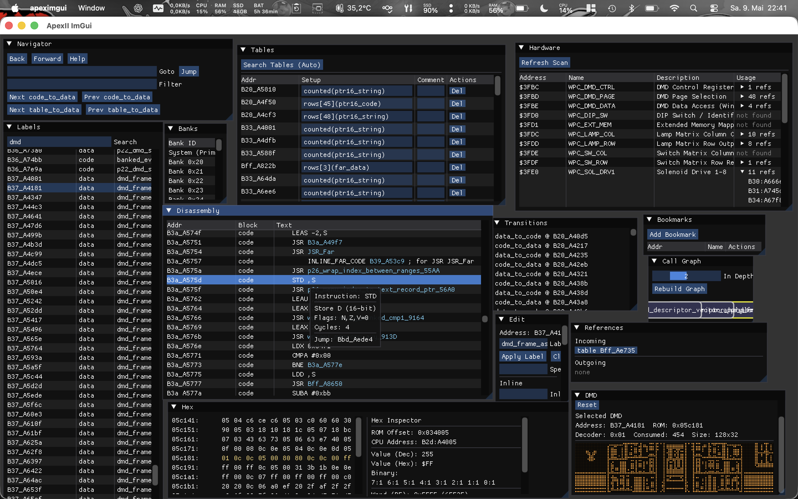
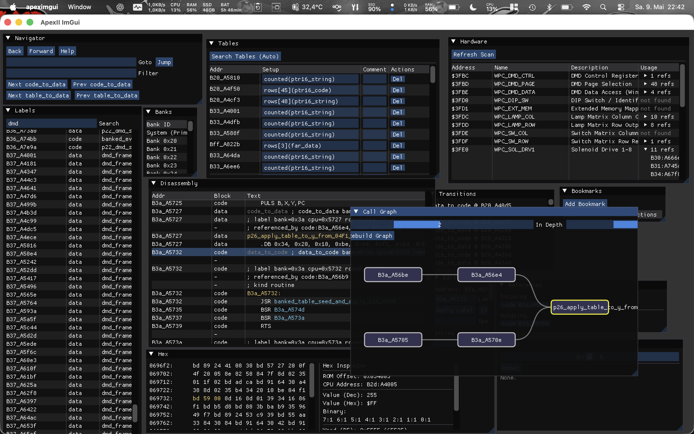

# ApexII - WPC Pinball Reverse Engineering Suite

ApexII is a specialized toolset designed for the high-performance reverse engineering of WPC (Williams Pinball Controller) software. It provides both an advanced static analyzer (CLI) and a rich graphical environment (GUI) to map hardware interactions, discover data structures, and reconstruct documented assembly code.

## Key Features

*   **Advanced Static Analysis**: Automated code-flow discovery, including support for WPC's specific "far-call" mechanisms and banked ROM layouts.
*   **Interactive UI (apeximgui)**: A professional ImGui-based suite featuring:
    *   **Visual Call Graph**: Bowtie-layout for recursive caller/callee traversal.
    *   **Hardware Device View**: Central mapping of ASIC registers ($3F00-$3FFF) to code usage.
    *   **Automatic Table Discovery**: Pattern-based search for text and data tables.
    *   **Hex Inspector**: Multi-format inspection (Hex, Dec, Bin, ASCII) with ROM-to-CPU address mapping.
    *   **DMD Preview**: Real-time decoding and scrubbing of DMD full-frame images.
    *   **Match from Reference**: GUI front-end for `apexmatch` — accept hundreds of OS labels from a reference ROM with a single click, review medium-confidence matches individually.
    *   **ROM Info**: OS version, game version string, checksum status, and CRC-32/SHA-1/SHA-256 hashes at a glance.
*   **ROM-to-ROM Label Transfer (apexmatch)**: Fingerprint-based matching propagates labels, inline signatures, and docs from an annotated ROM to any other WPC ROM — including cross-game OS layer transfer (~250–300 matches out of the box).
*   **ROM Metadata (apexmeta)**: Inspect and fix WPC ROM checksums; display OS version, game version, and file hashes (CRC-32, SHA-1, SHA-256).
*   **Modular Architecture**: Extensible design allowing for deep integration of game-specific logic.

---

## Tool Collection

### `apexdis` (CLI Disassembler)
The core analyzer. It processes a ROM image and a configuration overlay to produce a fully annotated assembly listing.

**Usage:**
```bash
apexdis roms/romimage.rom out/romimage.asm
apexdis --xref roms/romimage.rom out/romimage.asm tests/romimage.ini
apexdis --xref --explain roms/romimage.rom out/romimage.asm tests/romimage.ini
```

Flags:

- `--xref`: emit typed `referenced_by` comments and an `XREF INDEX`
- `--explain`: emit classification/provenance comments such as `config_entry`, `config_data`, `code_flow`, `table_ptr16_data_ref`, and so on

The disassembler expects a 512 KiB or 1 MiB WPC ROM. CPU-visible addresses are used throughout assembly and config files:

- paged ROM window: `0x4000..0x7fff`
- fixed system area: `0x8000..0xffff`

Generated assembly includes:

- `.ROM_SIZE <bytes>`
- `.BANK <index>` or system bank output in the fixed area
- `.ORG <cpu-address>`
- `BANK_ID <byte>` at the start of paged banks
- generated labels like `B20_A4000` or `Bff_A8990`
- comments with logical bank, CPU address, and physical ROM offset
- optional xref and explain comments

### `apextab`

Usage:

```sh
apextab <rom_file>
```

`apextab` is a heuristic scanner that currently looks for:

- likely counted string pointer tables
- likely headerless far-pointer tables that reference those string tables

It prints candidate config lines such as:

```ini
B20_A4007 = counted(ptr16_string)
Bff_A8123 = rows[3](far_data)
```

Treat its output as suggestions, not ground truth.


### `apeximgui` (Interactive GUI)

The primary analysis workstation for interactive disassembly, labeling, and structure definition.

**Launch:**

```bash
apeximgui <rom> [config.ini]   # open ROM with optional config
apeximgui                      # file pickers open automatically at startup
```

When started without arguments (and no saved session), a file picker appears to select the ROM, followed by an optional INI picker.

**File menu:**

| Item | Description |
|---|---|
| Save Overlay (`Ctrl+S`) | Write accumulated edits to `<config>.apeximgui.ini` |
| Save INI As… | Export the full merged config (base + all edits) to a new `.ini` file |
| Consolidate into Base INI | Merge overlay into the base INI and reset the overlay to empty |
| Re-analyze (`F5`) | Re-run analysis |
| Force Full Re-analyze (`Shift+F5`) | Flush cache and re-analyze from scratch |

**Key panels:**

- **Disassembly** — annotated listing with syntax highlighting, clickable labels, flow arrows
- **Labels / Banks / Bookmarks** — navigation panels
- **Edit** — set labels, classify bytes (code/data/string/table/inline), add docs
- **References** — incoming and outgoing cross-references for the selected address
- **Hex** — raw byte view, synced to disassembly selection
- **Inline Sigs / Code Entries** — bulk-edit inline signatures and code entry points
- **Symbols** — named RAM/hardware address definitions
- **ROM Map** — visual block overview across all banks
- **ROM Info** — OS version, game version string, checksum status, CRC-32/SHA-1/SHA-256 hashes (read-only; computed lazily on first open)
- **Match from Reference** — GUI front-end for `apexmatch` (see below)

**Keyboard shortcuts:**

| Key | Action |
|---|---|
| `J` / `K` | Move selection down / up |
| `N` / `P` | Next / prev block boundary |
| `F` / `Enter` | Follow link / jump to target |
| `[` / `]` | History back / forward |
| `G` | Go to address |
| `L` | Edit label |
| `C` | Mark as code |
| `D` | Mark as data |
| `Ctrl+S` | Save overlay |
| `F5` | Re-analyze |

**Match from Reference panel** (Windows → Match from Reference):

GUI front-end for the `apexmatch` fingerprint engine. Transfers labels and inline signatures from an annotated reference ROM to the currently open ROM without leaving the GUI:

1. Enter or browse for the reference ROM and its config INI.
2. Click **Run Match**. With **System scan** enabled, the scan phase runs automatically.
3. Results appear sorted by confidence tier — **Exact** (≥90%), **High** (≥75%), **Medium** (≥55%).
4. Click **Accept All Exact** to apply all exact matches in one step. The disassembly updates immediately.
5. Review High/Medium matches — click the address button to navigate to the target, then **Accept** individually or tier-by-tier.

Accepted matches write labels, code entries, inline signatures, and routine docs to the active overlay.

### `apexasm` (6809 Assembler)
A assembler optimized for WPC development. Used to re-assemble the reconstructed code back into a valid ROM image.

**Usage:**
```bash
apexasm game.asm output.rom
```

### `apexdmd` (DMD Utility)

Decodes WPC DMD (dot-matrix display) full-frame images out of a ROM and writes
them as portable bitmap/greymap files openable in any image viewer. A DMD full
frame is 128×32 pixels; the hardware shows 4 brightness levels by combining two
1-bit planes.

**Usage:**
```bash
apexdmd <rom> <Bxx_Ayyyy|0xhhhh> <out.pbm>          # one plane  -> PBM (1-bit)
apexdmd --pair <rom> <addr0> <addr1> <out.pgm>      # two planes -> PGM (4 grey levels)
apexdmd --table <rom> <config.ini> <table_addr> <outdir>   # whole frame table
```

Addresses use the usual forms: `Bxx_Ayyyy` (`xx` = bank in hex, `yyyy` = CPU
address) or `0xhhhh` for the system bank.

**Single frame** — decode one full frame to a 1-bit PBM:

```bash
apexdmd roms/taf_l7.rom B34_A4001 out/frame.pbm
```

**Plane pair** — many images store two planes that combine into a 4-level
greyscale frame; give both plane addresses to get a PGM:

```bash
apexdmd --pair roms/taf_l7.rom B34_A4001 B34_A41c2 out/frame.pgm
```

**Frame table** — bulk-decode every frame referenced by a far-pointer table. The
table must be classified in the config as a headerless `rows[n](far_dmd)` (or
`rows[n](far_data)`) table — exactly what the GUI *Tables* search or a `[tables]`
entry produces:

```bash
apexdmd --table roms/taf_l7.rom tests/taf_l7.ini Bff_Ae735 out/dmd_frames
```

This writes one `frameNNN.pbm` per row into the output directory plus a
`summary.tsv` listing each frame's index, target address, decoder type, and byte
length — the quickest way to dump a whole animation. The printed `type=0x..`
reports which WPC full-frame encoding (raw or run-length/“skip”) was used. PBM/PGM
are written directly, with no external dependencies.

### `apexini` (Config File Utilities)

A set of utilities for inspecting and maintaining `.ini` config files.

**Usage:**
```bash
apexini check   <file.ini> ...
apexini overlaps <file.ini>
apexini merge   <out.ini> <file.ini> ...
```

**`check`** — validates one or more config files and reports any errors (bad addresses, invalid specs, duplicate label names, etc.). Prints entry counts on success:

```text
myconfig.ini: OK  labels=42  entries=7  inline=15  data=3  tables=6  types=2
myconfig.ini: error: label 'FarCall' is defined at more than one address
```

**`overlaps`** — detects address conflicts and byte-range overlaps within a config:

- same address classified in two different sections (e.g. both `[inline]` and `[entries]`)
- a ranged entry (inline sig, `bytes[N]`, `far_*`, `rows[N](schema)`) extending into another entry

```text
conflict: Bff_A8005  [entries] code  vs  [inline] 1 bytes
overlap:  [inline] B3d_A7840 (byte, 4 bytes, ends 0x7843) into [data] B3d_A7842 (bytes[10])
```

**`merge`** — combines multiple config files into one clean sorted output. Later files override earlier ones for the same address. Sections are sorted alphabetically (types, schemas, symbols) or by bank+address (all others). Useful for flattening an `include =` chain into a single self-contained file:

```bash
apexini merge combined.ini base.ini overlay.apexgui.ini
```

**`migrate`** — rewrites config files in-place, replacing the legacy `[routine_docs]` and `[table_docs]` sections with a single `[docs]` section. A `.bak` backup is written before overwriting:

```bash
apexini migrate myconfig.ini
# migrated myconfig.ini  (12 doc entries → [docs])
```

### `apexmatch` (ROM-to-ROM Label Transfer)

Transfers labels, inline signatures, and routine documentation from a well-annotated source ROM to a different target ROM by fingerprint matching — no manual re-analysis needed.

**Usage:**
```bash
apexmatch <source.rom> <source.ini> <target.rom> [options]
```

**Examples:**
```bash
# Propagate WPC OS labels from Addams Family to Gilligan's Island
apexmatch roms/addam_h4.rom addam_h4.ini roms/afgldlx3.rom \
    --scan --output afgldlx3_os_labels.ini --stats

# Transfer full label set between two versions of the same game
apexmatch roms/taf_l7.rom taf_l7.ini roms/taf_l8.rom \
    --inject-paged --output taf_l8_from_l7.ini --verbose
```

**Options:**

| Flag | Default | Description |
|------|---------|-------------|
| `--min-confidence N` | 55 | Skip matches below N% |
| `--min-instrs N` | 5 | Min instructions for medium-confidence matches (filters short stubs) |
| `--inject-paged` | off | Also inject paged-bank entries into target analysis (default: system bank only) |
| `--scan` | off | Scan every byte of the target's system bank for exact matches; finds functions at shifted addresses not reached by code-flow injection; recommended for cross-game use; ~1–2 s extra |
| `--output FILE` | stdout | Write generated `.ini` to FILE |
| `--stats` | off | Print per-phase match counts to stderr |
| `--verbose` | off | List named source functions that found no match |

**How it works:**

Each named code label is fingerprinted using three independent FNV-32 hashes:

- **L1** — mnemonic sequence only (address-independent): finds routines that have simply moved
- **L2** — mnemonic sequence + immediate operand values: distinguishes routines with different constants
- **L3** — sequence of callee L1 hashes: structural match based on call graph shape

Confidence levels: **exact** (L1 + L2, 90%) / **high** (L1 + callees, 75%) / **medium** (L1 only, 55%).

**Output** is a valid `.ini` overlay with `[labels]`, `[inline]` signatures, and `[docs]` transferred from the source. Validate with `apexini check` before use.

**Cross-game WPC OS transfer:** WPC games share the same operating system in the system bank (0x8000–0xffff). After annotating one game's OS layer, `apexmatch` propagates ~250–300 labels (e.g. `JSR_Far`, `DisplayEffect_Start`, `LampLogical_SetInline`) and their inline signatures to any other WPC ROM automatically.

### `apexmeta` (ROM Metadata)

Displays metadata for a WPC ROM and can fix or disable the hardware checksum check.

**Usage:**
```bash
apexmeta <rom-file> [options]
```

**Example output:**
```text
ROM:           roms/addam_h4.rom
Size:          524288 bytes (512 KB)

OS Version:    3.21
Game Version:  REV. H-4  (offset 0x4CDC2)

Checksum:
  Stored:      0xFB06  (CPU 0xFFEE / file +0x7FFEE)
  Computed:    0xFB06
  Status:      VALID
  Delta:       0x3404  (CPU 0xFFEC / file +0x7FFEC)

Hashes:
  CRC-32:      D0BBD679
  SHA-1:       ebd8c4981dd68a4f8e2dea90144486cb3cbd6b84
  SHA-256:     571b53155d62ae9ed8f8b357ae33cecb1cbc72b642aca3a67b06118a786e73b9
```

**Options:**

| Option | Description |
|---|---|
| `--fix -o out.rom` | Recompute a valid (checksum, delta) pair and write modified ROM |
| `--disable -o out.rom` | Set delta to `0x00FF` — WPC hardware skips checksum check |
| `--verify` | Exit 0 if checksum valid, 1 if invalid (no output; for scripting) |

**Checksum algorithm:** the 16-bit sum of all ROM bytes mod 65536 must equal the stored value at CPU `0xFFEE`. A companion fixup word at `0xFFEC` participates in the sum and is adjusted by `--fix` to satisfy the equation. Setting the fixup to `0x00FF` disables the hardware check entirely (a feature of original WPC ROMs).

**OS Version** is read from the two bytes immediately before the reset routine, located via the 6809 reset vector at `0xFFFE`. **Game Version** is found by scanning for the pattern `REV. [A-Z]-[0-9]+`.

No external dependencies — CRC-32, SHA-1, and SHA-256 are implemented in a single header (`src/apex_rominfo.h`), also used by the GUI ROM Info panel.

---

## Build And Test

```sh
make
make test
```

Linux is the primary development platform and the default build path.

If you only need the command-line tools, you can build just those with:

```sh
make apexcli
```

Build products:

- `build/apexdis`
- `build/apexasm`
- `build/apeximgui`
- `build/apextab`
- `build/apexini`
- `build/apexmatch`
- `build/apexmeta`

### Dependencies

For the full build including `apeximgui` you need:

- a C compiler
- a C++ compiler
- `make`
- `pkg-config`
- SDL2 development headers and libraries
- OpenGL development headers and libraries

The CLI tools do not depend on SDL2/OpenGL.

### Linux

The current `Makefile` is aimed at Linux first.

Typical requirements:

- `gcc`
- `g++`
- `make`
- `pkg-config`
- `libsdl2-dev`
- OpenGL development package (`libgl-dev` or distro equivalent)

Then:

```sh
make
make test
```

### Windows

Use **MSYS2 MinGW-w64**. The project is not currently set up for a direct MSVC / Visual Studio build.

Recommended environment:

- MSYS2 `UCRT64` or `MINGW64` shell
- `make`
- `gcc`
- `g++`
- `pkg-config` / `pkgconf`
- `git`
- `SDL2`

Typical MSYS2 package set:

- `base-devel`
- `mingw-w64-ucrt-x86_64-toolchain` or `mingw-w64-x86_64-toolchain`
- `mingw-w64-ucrt-x86_64-pkgconf` or `mingw-w64-x86_64-pkgconf`
- `mingw-w64-ucrt-x86_64-SDL2` or `mingw-w64-x86_64-SDL2`
- `git`

Notes:
- Windows build is not yet tested, main development and test platform is Linux and MacOS (It would be nice to hear from you if you manage to build and run the toolkit on windows)
- `apeximgui` links OpenGL as `-lopengl32` on Windows.
- `make test` expects a POSIX shell environment and tools such as `sh`, `cmp`, `grep`, `sed`, `od`, and `wc`, so run it from the MSYS2 shell, not plain `cmd.exe`.

### macOS

Use Apple Clang plus Homebrew-installed libraries.

Requirements:

- Xcode Command Line Tools
- `make`
- `pkg-config`
- `sdl2`

Typical setup:

```sh
xcode-select --install
brew install pkg-config sdl2
make
make test
```

Notes:

- `apeximgui` links against `-framework OpenGL` on macOS.
- OpenGL is deprecated on macOS, but it is sufficient for the current ImGui frontend.
- The CLI test suite uses standard Unix command-line tools that are available on macOS by default.
---

## Assembly Syntax

Core directives:

```asm
.ROM_SIZE 524288
.BANK 0x00
.ORG 0x4000
BANK_ID 0x20
FILL_TO_BANK_END
```

Data directives:

```asm
.DB 0x12, 0x34
.DW 0x8000
STRING "PRESS \"ENTER\""
```

Far pointers are encoded as `addr_hi, addr_lo, bank_byte`:

```asm
FAR_CODE B21_A4006, 0x01
FAR_STRING B21_A4001, 0x01
FAR_PTR B21_A4004, 0x01
FAR_TABLE B21_A5000, 0x01
```

If the encoded bank byte matches the generated bank label, the explicit bank byte may be omitted:

```asm
FAR_CODE B3d_A784b
```

Table pseudo-ops:

```asm
TABLE_PTR B3b_A415c
TABLE_FAR_CODE Bff_Aedbe
TABLE_FAR_STRING B21_A4001, 0x01
TABLE_FAR_PTR B21_A4004, 0x01
TABLE_FAR_TABLE B21_A5000, 0x01
```

Inline payload after `JSR`/`JMP` is emitted indented:

```asm
    JSR FarCall
        INLINE_FAR_CODE B38_A4001, 0x18 ; for JSR FarCall

    JSR Panic
        INLINE_BYTE 0x04 ; for JSR Panic

    JSR InlineComplex
        INLINE_PTR B21_A4004 ; for JSR InlineComplex
        INLINE_FAR_PTR B21_A4004, 0x01 ; for JSR InlineComplex
        INLINE_CODE_PTR B21_A4006 ; for JSR InlineComplex
        INLINE_WORD 0x1234 ; for JSR InlineComplex
```

`.DB` output now includes end-of-line comments with logical start address and ASCII preview:

```asm
    .DB 0x41, 0x42, 0x00 ; 0x4000 |AB.|
```

## Config File Format

Config files are INI-like.

- empty lines are ignored
- text after unescaped `;` or `#` is ignored outside quotes
- use `\;`, `\#`, `\\`, `\"`, `\n` inside quoted values
- the same section may appear multiple times
- repeated sections accumulate
- later entries for the same key override earlier ones in practice
- `include = other.ini` is supported at top level

Relative includes are resolved relative to the including file.

Example:

```ini
include = common_wpc.ini
include = addams_tables.ini
```

Addresses:

- system addresses may be written as `0x8990` or `Bff_A8990`
- banked addresses use generated bank-label keys like `B3b_A4001`

### `[options]`

```ini
[options]
labels_are_entries = false
```

Supported options:

- `labels_are_entries`
  - legacy behavior default: `true`
  - recommended new behavior: `false`
  - when `false`, `[labels]` only names addresses; `[entries]`, `[data]`, and `[tables]` control classification

### `[labels]`

Assigns names to known code/data/table locations.

```ini
[labels]
0x8990 = FarCall
0x82d1 = Panic
B3d_A784b = ThingAwardFarEntry
```

Multiple labels may point at the same address. They are emitted as aliases.

### `[entries]`

Adds explicit code entry points.

```ini
[entries]
0x8123 = code
B38_A5100 = code
```

`= entry` is also accepted.

### `[inline]`

Defines routines that consume inline bytes after `JSR`/`JMP`.

Examples:

```ini
[inline]
0x8990 = far_code, FarCall
0x82d1 = 1, Panic
0x8c97 = bytes:2, far_code, Unknown_take_2_bytes_then_far_code_8c97
0x8123 = ptr16_data, far_data, ptr16_code, word, bytes[2]
0x8200 = byte:mode
0x8210 = far_code:handler
```

Supported forms:

- `<addr> = <N>`
- `<addr> = <N>, <alias>`
- `<addr> = byte:<name>`
- `<addr> = far_code`
- `<addr> = far_code, <alias>`
- `<addr> = far_code:<name>`
- `<addr> = bytes:<N>, <field>`
- `<addr> = <field>[, <field>...]`

Inline fields use the same field grammar as table rows:

- `byte`
- `bytes[N]`
- `word`
- `ptr16_string`
- `ptr16_data`
- `ptr16_code`
- `ptr16_table`
- `far_string`
- `far_data`
- `far_table`
- `far_code`

Important limitation:

- a full multi-parameter naming model does **not** exist yet
- current named support is only for the simple single-parameter cases such as `byte:name` or `far_code:name`
- multiple typed inline parameters work, but not with a separate persisted name for every field

### `[schemas]`

Reusable table row schemas.

```ini
[schemas]
menu_row = bytes[1], word, far_data
score_event = byte, ptr16_string, far_code
```

Usage:

```ini
[tables]
B20_A4007 = rows[1](menu_row)
B30_A5000 = counted(score_event)
```

### `[tables]`

Defines table starts and row layouts.

Counted tables have a 3-byte header:

- 2 bytes row count
- 1 byte row width

Headerless tables specify the row count in config.

Examples:

```ini
[tables]
B3c_A4001 = counted(ptr16_string)
B3b_A5588 = counted(ptr16_data)
Bff_A8001 = rows[116](far_code)
B20_A4007 = rows[1](byte, far_data)
```

Legacy aliases are still accepted:

```ini
B3b_A4001 = counted_ptr16_string
Bff_A8001 = far_code[116]
```

Supported row fields:

- `byte`
- `byte[N]`
- `bytes[N]`
- `word`
- `word[N]`
- `ptr16_string`
- `ptr16_data` or `ptr16_ptr`
- `ptr16_code`
- `ptr16_table`
- `far_string`
- `far_data` or `far_ptr`
- `far_table`
- `far_code`

Examples:

```ini
B20_A4007 = rows[1](byte, far_data)
B30_A5000 = counted(bytes[2], word, ptr16_string, far_code)
```

### `[data]`

Defines standalone data ranges or standalone far pointers.

```ini
[data]
Bff_A8002 = bytes[3]
B3b_A415c = string
B20_A400b = far_code
B20_A4010 = far_string
B20_A4013 = far_data
B20_A4016 = far_table
```

Supported forms:

- `bytes[N]`
- `string`
- `far_code`
- `far_string`
- `far_data` or `far_ptr`
- `far_table`

Use `[data]` when bytes must stay data even if they look reachable from code.

### `[symbols]`

Defines RAM/ASIC symbols emitted as equates near the top of the output.

```ini
[symbols]
_ROM_BANK_SHADOW = 0x0011
_ASIC_ROM_PAGE = 0x3ffc
DMD_FRAMEBUFFER_3800 = 0x3800
```

### `[docs]`

Attaches a documentation string to any address — code, table, or data. The string is emitted as a `; doc …` comment in the disassembly.

```ini
[docs]
0x8990 = "WPC far-call helper\; consumes a far-code pointer.\nUse \# for literal hash."
Bff_A8001 = Headerless dispatcher table containing far-code routine entry pointers.
B3c_A4001 = Classic WPC counted string pointer table.
```

Multi-line docs should be quoted and use `\n`. The legacy section names `[routine_docs]` and `[table_docs]` are still accepted on load for backwards compatibility — use `apexini migrate` to convert them.

## Cross References And Explain Output

Configured pointers and discovered flows produce typed reference comments where possible:

```asm
; referenced_by table:B20_A4007, code:B21_A4006, data:B20_A400d
```

Meaning:

- `code:` instruction flow or inline code pointer
- `table:` configured table field
- `data:` configured standalone pointer/data field

`--xref` also emits a grouped `XREF INDEX` at the end of the file.

`--explain` emits provenance comments such as:

```asm
; explain label source=config_label
; explain kind=code source=config_entry
; explain inline source=config_inline
```

These are useful for debugging misclassification and config interactions.

## GUI Overlay Files

The GUI writes an overlay config next to the chosen base config:

```text
tests/taf_l7_minimal.ini.apexgui.ini
```

Typical contents:

```ini
; Apex GUI overlay
include = taf_l7_minimal.ini

[labels]
B20_A40d5 = RoundtripGuiLabel

[inline]
B20_A40d5 = far_code

[entries]
B20_A40d5 = code

[docs]
B20_A40d5 = "Roundtrip GUI routine doc"
```

Current GUI overlay sections:

- `[labels]`
- `[inline]`
- `[entries]`
- `[data]`
- `[tables]`
- `[docs]`

## Diagnostics And Validation

The loader rejects several ambiguous or unsafe states:

- invalid label or symbol names
- names colliding with assembler syntax like `JSR`, `STRING`, `TABLE_PTR`
- same label name assigned to more than one address
- exact address conflicts between `[entries]` and `[data]`
- exact address conflicts between `[tables]` and `[data]`
- invalid inline/table/data syntax

Truncated or invalid inline payloads are reported to `stderr` and also emitted as warning comments in the disassembly.

The roundtrip test script reports the first byte mismatch like this:

```text
mismatch rom=0x012345 bank=0x28 cpu=0x4567 original=0xab rebuilt=0xcd
```

## Far Pointer Bank Bytes

Far pointers are `address-high, address-low, bank-byte`.

- `0xff` means fixed system area
- for paged targets, the disassembler first interprets the byte as a ROM bank ID
- if that fails, it falls back to physical bank index interpretation

When encoded bank byte and generated label bank differ, the emitted pseudo-op keeps the explicit byte:

```asm
INLINE_FAR_CODE B38_A4001, 0x18
```

That preserves byte-identical assembly.

---

## Usage Guide

### General Workflow
1.  **Open** the ROM in `apeximgui`.
2.  **Analyze**: Use the "Hardware" window to find solenoid/lamp handlers.
3.  **Label**: Name routines and data ranges to improve readability.
4.  **Tables**: Use "Search Tables (Auto)" to find text/data structures. Define other tables (e.g. jump-tables without the standard WPC table header)
5.  **Export**: Save your progress as an `.ini` overlay.
6.  **Listing**: Generate a full `.asm` file using `apexdis`.

Now you can modify the assembly and rebuild an WPC Rom with apexasm. NOTE: checksum is not (yet) fixed automatically, if you change the ROM contents you have to fix the checksum with external tools. 

### apeximgui Screenshots

*Figure 1: Main Disassembly, Navigator, Labels, DMD View*


*Figure 2: Disassembly with tooltip, shows instruction details


*Figure 3: Call Graph*

### Essential Hotkeys
*   `G` / `L`: Focus Goto / Label field.
*   `/`: Focus global filter.
*   `J` / `K`: Move selection down/up.
*   `F` / `Enter`: Follow link/pointer.
*   `X`: Show incoming references (XRefs).
*   `B`: Add bookmark at current location.
*   `Ctrl+S`: Save overlay file.
*   `Ctrl+F`: Global search.
*   `Alt + Left/Right`: Navigate through history.

---

## Configuration Format (.ini)

ApexII uses a simple INI-based format to persist your analysis. These files can be shared and are used by `apexdis` to generate commented code.

See [docs/config-format.md](docs/config-format.md) for the full reference.

Example:
```ini
[labels]
Bff_A8000 = Reset_Entry
B00_A4500 = Lamp_Handler

[data]
B00_A7000 = string
B21_A4000 = dmd_fullframe

[tables]
B01_A5000 = counted(ptr16_string)
```

---

## Legal & Safety Notice

**Disclaimer of Liability**: ApexII is an analysis tool. Modifying ROM images and running them on real hardware can lead to permanent damage to your pinball machine (e.g., burnt solenoids, ASIC failure). The authors take no responsibility for any hardware damage or loss of data.

**Copyright Note**: This tool is intended for educational purposes and the preservation of pinball history. Users are responsible for complying with local copyright laws regarding the disassembly and modification of proprietary firmware.

---

## License

This project is licensed under the **MIT License**. See the [LICENSE](LICENSE) file for the full text.


## Authors

Supervisor: Walter Haslbeck (redball@haslbeck.org), Code: Codex, Gemini, Sonnet
